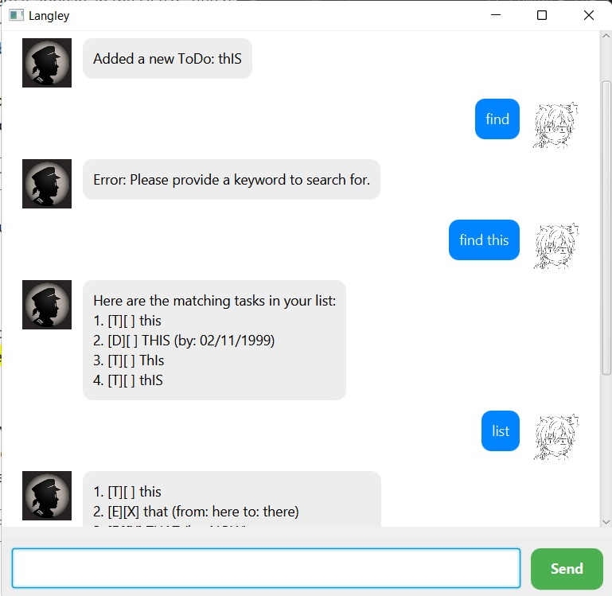

# Langley User Guide



Welcome to **Langley**, your personal task management bot designed to help you track and organise your tasks efficiently. Langley offers a simple, command-based interface that lets you manage todos, deadlines, events, and more. This guide will walk you through the features available in Langley, complete with usage examples and expected outputs.

## Adding Todos

To add a simple task that doesn't have a specific deadline or time frame:

**Command:**

```
todo [description]
```

**Example:**

```
todo read book
```

**Expected Output:**

```
Added a new ToDo: read book
```

This will add a basic todo task to your list.

---

## Adding Deadlines

Deadlines allow you to add tasks that need to be completed by a specific date or time.

**Command:**

```
deadline [description] /by [due date]
```

**Example:**

```
deadline return book /by Sunday
```

**Expected Output:**

```
Added a new Deadline: return book (by: Sunday)
```

You can specify the date in various formats, including natural language (e.g., "Sunday").

---

## Adding Events

Events let you specify tasks with a start and end time.

**Command:**

```
event [description] /from [start time] /to [end time]
```

**Example:**

```
event project meeting /from 2023-09-21 /to 2023-09-22
```

**Expected Output:**

```
Added a new Event: project meeting (from: 21/09/2023 to: 22/09/2023)
```

---

## Listing All Tasks

To view all the tasks currently in your list:

**Command:**

```
list
```

**Expected Output:**

```
1. [T][ ] read book
2. [D][ ] return book (by: Sunday)
3. [E][ ] project meeting (from: 21/09/2023 to: 22/09/2023)
```

The tasks are listed in the order they were added, along with their type (T for ToDo, D for Deadline, and E for Event) and completion status.

---

## Marking a Task as Completed

To mark a task as completed:

**Command:**

```
mark [task number]
```

**Example:**

```
mark 1
```

**Expected Output:**

```
I've marked this:
  [T][X] read book
```

The task is now marked as completed.

---

## Unmarking a Task

To unmark a previously completed task:

**Command:**

```
unmark [task number]
```

**Example:**

```
unmark 1
```

**Expected Output:**

```
I've unmarked this:
  [T][ ] read book
```

The task is now marked as incomplete.

---

## Deleting a Task

To delete a task from your list:

**Command:**

```
delete [task number]
```

**Example:**

```
delete 2
```

**Expected Output:**

```
I've deleted this task:
  [D][ ] return book (by: Sunday)
```

---

## Searching for Tasks by Keyword

You can search for tasks in your list using a keyword. The search is case-insensitive and will return all tasks containing the keyword.

**Command:**

```
find [keyword]
```

**Example:**

```
find book
```

**Expected Output:**

```
Here are the matching tasks in your list:
1. [T][X] read book
2. [D][ ] return book (by: Sunday)
```

---

## Saving Tasks

Langley automatically saves your tasks in a file called `Langley.txt` in the current working directory. Any changes made (like adding, marking, or deleting tasks) will be saved automatically.

---

## Loading Tasks

When Langley starts, it will automatically load any tasks saved in `Langley.txt`. If no such file exists, Langley will start with an empty task list.

---

## Exiting the Program

To exit the Langley bot:

**Command:**

```
bye
```

**Expected Output:**

```
We will meet again.
```

---

That's all for the Langley User Guide! With these commands, you can now manage your tasks effectively. Happy tasking!